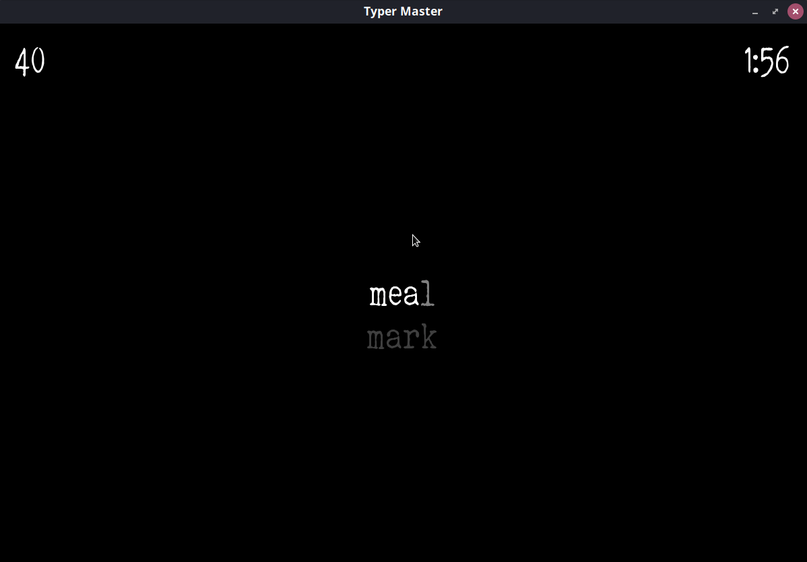
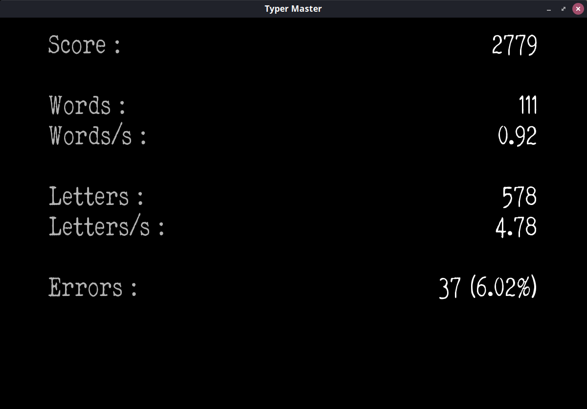

# Typer Master

Typer Master is a (really) basic typing game made with LÖVE. The goal is to type the words that appear on the screen as fast as you can.

## Usage

`[Enter]` Confirm, go to next screen.

`[Escape]` Go back to the start menu.

`[F11]` Toggle full screen.

## Build

Builds for Windows and Linux (_AppImage_), as well as a _.love_ file, are available [right here](http://github.com/tarhses/typer-master/releases/tag/v1.1). If you want to build it yourself, please refer to LÖVE's wiki about [game distribution](http://love2d.org/wiki/Game_Distribution).

## Changelog

* **v1.0** (2020/02/25) - Initial release.
* **v1.1** (2020/07/13) - English translation.

## License

This software and its sources are published under the [MIT licence](LICENSE).

It uses [LÖVE](http://love2d.org/) (zlib/libpng), [hump](http://github.com/vrld/hump) (MIT), [json.lua](http://github.com/rxi/json.lua) (MIT), and Lukas Krakora's [Elegant Typewriter](http://www.dafont.com/elegant-typewriter.font) font (free for non-commercial use).